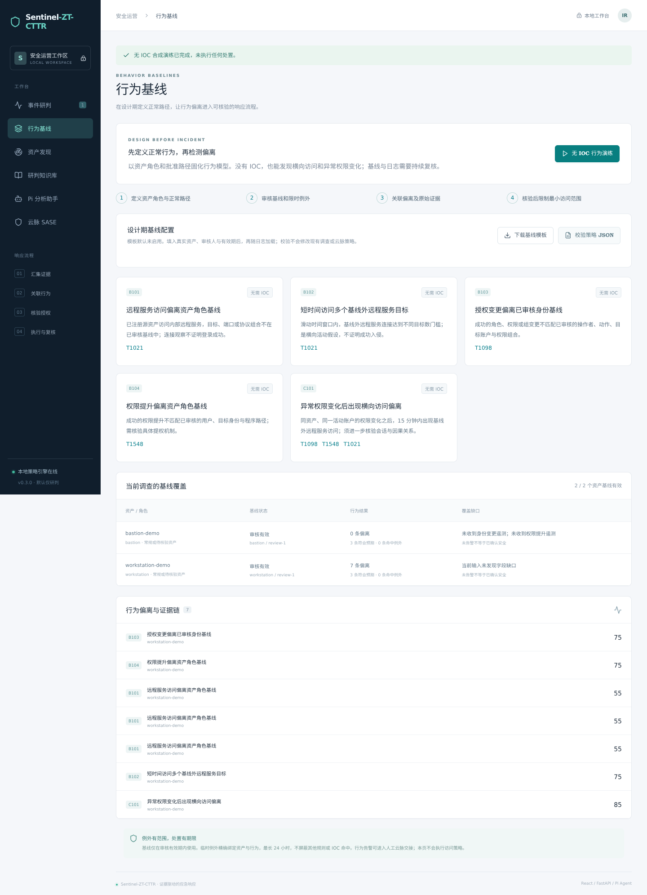
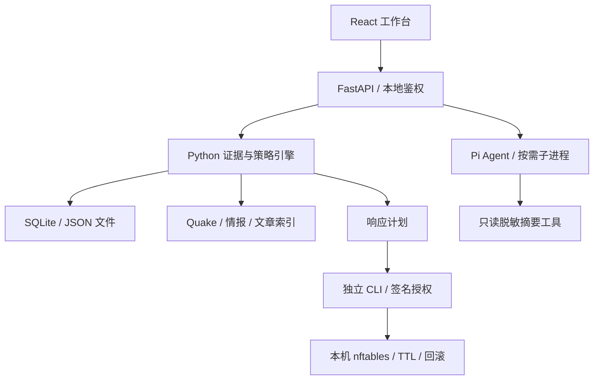

# Sentinel-ZT-CTTR

**将行为基线前置到设计期的轻量零信任应急响应工作台。**

GitHub Description:

> Behavior-first incident response with ATT&CK-mapped baselines, asset context and zero-trust response workflows. Built with React, FastAPI and Pi Agent; detects modeled deviations without waiting for PoCs or IOCs.

React + FastAPI + Pi Agent Core。提前审核资产角色、正常访问路径与权限变更流程，关联行为偏离和资产上下文；威胁情报作为补充证据。

**v0.3.0 / 行为基线与设计期响应版**：用于实验室演练和分析员辅助研判。检测规则需要按业务基线调优；风险分是优先级，不是失陷概率。云脉接入尚待真实租户验证。安全修复与验证记录见 [安全审查报告](docs/SECURITY_REVIEW_v0.3.0.md)。



[事件研判界面](docs/console.png) · [基线设计与使用指南](docs/BEHAVIOR_BASELINES.md)

## 快速启动

需要 Python 3.11+。交付包已包含构建后的 React 前端；基础工作台不需要安装 Node。

```bash
python -m venv .venv
# Linux / macOS
source .venv/bin/activate
# Windows PowerShell: .\.venv\Scripts\Activate.ps1
python -m pip install -r requirements-web.txt
python scripts/serve.py
```

浏览器打开 `http://127.0.0.1:8000`，输入终端显示的本地访问令牌，点击 **演练示例**。

系统生成 23 条合成事件，识别文档执行、Web 服务异常执行、Agent 工具滥用等 3 个事件，展示证据和响应计划。不会改变系统防火墙。日志、调查记录、访问令牌保存在本机 `.sentinel-data/`。

在“行为基线”页点击 **无 IOC 行为演练**：11 条合成日志产生 7 条线索、1 个高风险事件；正常跳板路径和已批准的权限工作流保持安静。该演练使用零条 IOC，也不需要 PoC。

纯命令行运行不依赖第三方 Python 包：

```bash
python -m sentinel_zt demo --out output/demo
python -m sentinel_zt behavior-demo --out output/behavior-demo
python -m sentinel_zt --help
python -m unittest discover -s tests -v
```

## 已实现的能力

| 模块 | 当前实现 |
| --- | --- |
| 日志接入 | 标准 JSONL、Sysmon JSONL、Suricata EVE、nginx common/combined |
| 威胁情报 | JSON / CSV、STIX 2.1 单一等值 Indicator 子集；IP、精确域名、URL、MD5/SHA1/SHA256 |
| 情报校验 | 来源、置信度、撤销状态、有效期；精确匹配与去重；复杂 STIX 模式显式跳过 |
| 行为分析 | 原有 18 类行为检测与 4 类关联；新增 B101–B104 角色基线偏离和 C101 同账户权限变化→横向访问关联 |
| 日常基线 | 模板、CLI/API 校验、角色绑定、有效期、精确限时例外、偏离解释与遥测覆盖缺口；无 IOC 演练 |
| 资产发现 | 360 Quake 服务查询、离线导入、IP/端口归并、范围约束、快照比较 |
| 知识库 | `izj007/wechat` README 标题/链接同步、离线导入、关键词检索、案例参考关联 |
| 零信任策略 | 显式身份与资源授权、设备状态新鲜度、MFA、风险门槛、短期访问租约 |
| 响应 | 默认计划/预览；短期 HMAC 授权；Linux 本机 nftables 对端封禁；内核 TTL；审计与回滚 |
| Pi Agent | 真实 Pi Agent Core 运行时；3 个只读工具；脱敏摘要；模型调用需主动确认 |
| 工作台 | React 界面、FastAPI 鉴权接口、SQLite 调查历史、HTML/JSON 导出 |
| 云脉 SASE | 内网应用后方部署、精确 HTTPS Origin/Host、Nginx/systemd 模板、人工处置交接单；未接入云脉管理 API |

## 轻量架构



FastAPI 同时托管构建后的 React 静态文件。Pi 按需启动，不常驻独立服务。无 Redis、消息队列、向量数据库、远程代码执行器或默认 Agent Shell。Pi 使用 `@earendil-works/pi-agent-core`，即原 `badlogic/pi-mono` 项目当前的包命名；依赖版本已锁定。

## 把响应前置到设计期

1. 登记资产角色、IP 和重要性，审核正常远程服务路径、身份授权组合与权限提升程序。
2. 生成草案并填写审核人、版本和有效期；模板默认不启用，核验后再设置 `enabled=true`。
3. 在基线工作台校验策略并用于日志分析；核对偏离事件、业务上下文、限时例外及缺失遥测。
4. 无 IOC 高风险行为也能进入人工云脉交接；审批后在指定用户和应用范围内实施，并验证恢复。

```bash
python -m sentinel_zt baseline-template --out private/baseline-policy.json
# 编辑并审核草案中的资产、角色、预期路径和有效期
python -m sentinel_zt baseline-check --policy private/baseline-policy.json
python -m sentinel_zt analyze --events private/events.jsonl \
  --policy private/baseline-policy.json --out output/behavior-investigation
```

当前通过日志导入、CLI 或 API 批次分析产生线索；不是已部署的持续采集、实时告警推送或自动云脉执行服务。模型只能检测已建模且有足够遥测的偏离，不承诺覆盖全部未知攻击。部署期数据契约和日常复核步骤见 [行为基线指南](docs/BEHAVIOR_BASELINES.md)。

## 接入真实日志

```bash
python -m sentinel_zt analyze \
  --events private/events.jsonl \
  --intel private/intel.json \
  --policy private/policy.json \
  --out output/incident
```

先复制 `examples/policy.json`，填写真实资产、IP、权限及受保护管理网段。新发现的资产不会自动成为可信资产。Sysmon 必须导出为文档约定的 JSONL；不直接解析二进制 EVTX。

```bash
python -m sentinel_zt analyze --events private/eve.json \
  --format suricata --host web-01 --policy private/policy.json --out output/eve
```

Suricata 的 `--host` 必须是**单一被监测端点**，不是传感器名；多资产 EVE 应先按资产拆分并映射。无认证字段的 HTTP 200 不会被推断为未授权成功。对历史日志使用 `--at 2026-09-20T12:00:00Z` 回放；历史计划不能在当前时点执行。

详见 [数据契约](docs/DATA_CONTRACT.md)、[检测规则与证据边界](docs/DETECTIONS.md)。

## 360 Quake

按用户提供的 Quake API 文档实现 `POST /api/v3/search/quake_service` 与 `X-QuakeToken`。这是测绘数据库查询，不主动扫描目标。使用服务端环境变量提供密钥：

```bash
export QUAKE_API_KEY='你的 Quake API Key'
export SENTINEL_SCOPE='/absolute/path/to/private/scope.json'
python scripts/serve.py
```

PowerShell 对应 `$env:QUAKE_API_KEY='...'`、`$env:SENTINEL_SCOPE='C:\...\scope.json'`。scope 文件只填写你的组织资产范围，结构见 `examples/scope.json`。

```bash
python -m sentinel_zt quake-search --query 'service:http' \
  --scope private/scope.json --policy private/policy.json --limit 100 --out output/assets.json
python -m sentinel_zt quake-import --input examples/quake-service.json \
  --scope examples/scope.json --policy examples/policy.json --out output/assets.json
python -m sentinel_zt asset-diff --before output/previous.json --after output/assets.json --out output/diff.json
```

默认最多 100 条，单次上限 1000 条；查询可能消耗 Quake 配额。固定 HTTPS 官方端点、禁止重定向、分页限额、短重试、返回结果再做范围过滤。域名归属不证明独占 IP；共享云地址不会自动扩展封禁。观测时间未知/陈旧的资产只作为待核验上下文，不提高自动响应权限。

## wechat 研判知识库

该仓库是文章收藏库。这里只建立标题与链接索引，不执行其中的脚本/PoC，也不将文章正文纳入本项目的 MIT 授权。

```bash
python -m sentinel_zt knowledge-sync --revision main --out output/knowledge.json
python -m sentinel_zt knowledge-search --index output/knowledge.json --query '应急响应 Webshell'
python -m sentinel_zt analyze --events private/events.jsonl --intel private/intel.json \
  --policy private/policy.json --assets output/assets.json --knowledge output/knowledge.json --out output/incident
```

生产复现建议把 `main` 换成固定 commit SHA。同步结果包含 README SHA256。网页可直接上传仓库 README 建立索引；内容仅作为未审阅的参考资料，不直接转成检测规则、IOC 或响应指令。

## 启用 Pi Agent

需要 Node.js 22+。基础检测无需模型或模型凭证。

```bash
cd agent
npm ci --ignore-scripts
cd ..
export SENTINEL_PI_ENABLED=1
export PI_PROVIDER=anthropic
export PI_MODEL=claude-sonnet-4-6
export ANTHROPIC_API_KEY='你的模型密钥'
python scripts/serve.py
```

也支持 `PI_PROVIDER=openai`、`OPENAI_API_KEY`，模型必须存在于锁定的 Pi model catalog。环境变量示例见 `.env.example`；启动脚本不自动加载 `.env`。

Pi 可调用 `incident_summary`、`explain_findings`、`response_plan` 三个只读工具；最多 4 轮、12 次工具调用、每轮最多 2000 输出 token，75 秒终止。模型无签名密钥、Shell 或处置工具。Pi 子进程只接收所选模型的凭证与必要运行环境，不继承工作台令牌、Quake Key 或其他服务密钥。只有用户勾选同意并点击分析，才发送本次问题和脱敏摘要；原始日志、资产名、IP、用户标识不在自动摘要内。问题里主动输入的信息仍会发送给配置的模型。

## 受控响应

### 云脉 SASE

将工作台作为云脉内网应用发布，应急人员通过云脉客户端和应用访问策略进入，再使用工作台令牌。FastAPI 保持本机监听，由内网 HTTPS 入口转发。云脉后方模式设置 `SENTINEL_DEPLOYMENT_MODE=yunmai` 和 `SENTINEL_PUBLIC_ORIGIN=https://你的应用域名`。

新增“云脉 SASE”页面可把事件转换为**待人工审核的用户到应用访问限制交接单**，包含证据、映射核验时间、建议有效期和恢复步骤。它不修改租户策略，也不等同于主机隔离。客户端 SDK 的连接/注销功能不能替代租户管理 API。

完整配置、部署模板、现场验收和后续 API 材料要求见 [云脉接入指南](docs/YUNMAI_SASE.md)。当前工作台仍使用共享操作令牌，不提供个人 SSO 或多人 RBAC。

### 本机处置

真实执行仅支持 Linux 目标本机的 nftables **对端 IP 入站/出站封禁**。不是远程 EDR 隔离，不接管 IdP，不处理转发流量。Web API 没有执行/签名端点。

完整操作及故障恢复见 [响应操作手册](docs/RESPONSE.md)。包括审核计划、生成本地密钥、签署短期授权、dry-run、显式 `--live`、单动作回滚和审计核验。不要将签名密钥放进 Web 服务环境。

## 开发与测试

```bash
python -m pip install -r requirements-test.txt
python -m unittest discover -s tests -v
cd agent && npm ci --ignore-scripts && npm test
cd ../web && npm ci --ignore-scripts && npm run build
```

v0.3.0 验证：208 项 Python/API 测试（新增 47 项）全部通过，Pi 4 项、前端 3 项通过。React 构建及基线模板、策略校验、无 IOC 演练、证据、人工云脉交接、移动布局浏览器检查通过。发布验证与第三轮安全修复详见 docs/VALIDATION.md。

**验证范围**：Quake 外部 API 与真实模型调用需要用户凭证，本次未联网验证；Pi SDK 用模拟模型流跑通；nftables 执行器用替身执行器测试，未在真实网络命名空间执行封禁。详见 [测试记录与限制](docs/VALIDATION.md)。

## 发布

本仓库只包含原创实现、通用行为规则和合成示例。原始演习报告、个人信息、真实 IOC、业务日志、凭证不随包发布。

```bash
git init -b main
git add .
git commit -m "Initial Sentinel-ZT-CTTR release"
gh repo create YOUR_ACCOUNT/Sentinel-ZT-CTTR --public --source=. --remote=origin --push
```

GitHub Actions 已配置 Python 测试、React 构建和 Pi 测试。项目代码 MIT，第三方依赖及引用遵循各自许可。详情见 [SECURITY.md](SECURITY.md) 和 [THIRD_PARTY.md](THIRD_PARTY.md)。
