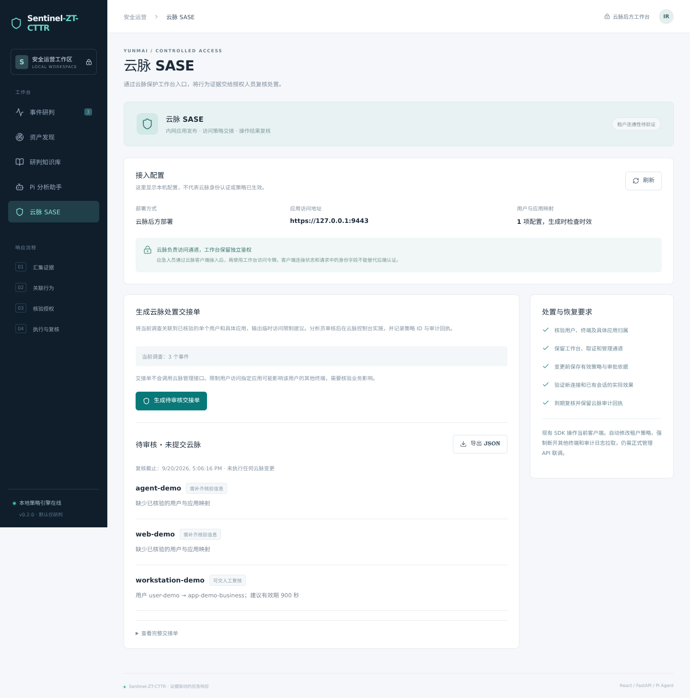
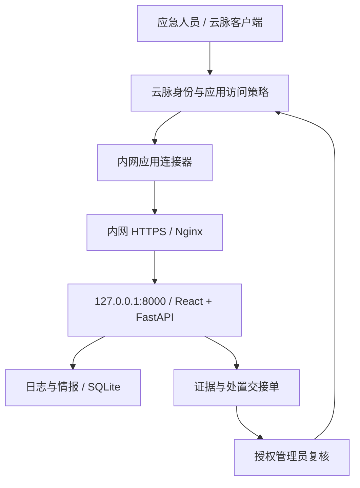

# Sentinel-ZT-CTTR 接入云脉 SASE

本方案将应急工作台发布为云脉内网应用。应急人员先完成云脉客户端认证和应用授权，再访问 Sentinel 工作台。Sentinel 负责证据分析与处置建议，云脉负责到应用的访问控制。本版实现部署适配和人工控制台交接；尚未连接真实租户，也未实现云脉管理 API 自动处置。



## 依据与能力范围

核对了用户提供的《云脉 SASE 接入操作指南》1.1–1.6 节，以及 2024 年 PC C/C++、Node.js、Android、iOS SDK 文档。旧文档说明可行的对接模式；租户当前菜单、授权、SDK 版本和既有会话处理语义必须现场核验。原始指南、SDK 二进制、示例凭证和企业下载地址不随公开项目发布。

| 需求 | 已核对依据 | 本版实现 |
| --- | --- | --- |
| 工作台位于云脉后方 | 指南 1.1、1.3：连接器、内网应用、地址及端口配置 | 精确 HTTPS Origin/Host 配置、回环后端、Nginx 与 systemd 模板 |
| 仅应急组访问 | 指南 1.2、1.4：用户/部门/用户组、允许或禁止、优先级、有效期 | 由租户管理员在云脉控制台配置；应用自身保留令牌认证 |
| 事件驱动的临时访问限制 | 指南 1.4 的控制台操作能力 | 生成待审核交接单，带证据、个体用户、具体应用、时限和恢复要求 |
| 自动修改策略、强制断开其他会话 | 已提供资料没有可实现的租户管理接口契约 | 未实现；需要正式管理 API、鉴权与权限说明 |
| 拉取访问日志/动态设备状态 | 指南提到日志审计；SDK 提供调用客户端状态 | 未实现服务端实时采集；需要审计 API/syslog 字段或脱敏导出样本 |
| 单点登录工作台 | 客户端 SDK 换取云脉身份不等于应用 SSO | 未实现 SSO；需要云脉支持的应用身份协议与验签/校验契约 |

客户端 SDK 中的 `yunmaiConnect`、`yunmaiDisconnect`、Android 隧道方法和 iOS 连接接口作用于调用 SDK 的客户端。PC 文档明确说明 `yunmaiLogout`/`YUNMAI_logout` 可能删除设备登记并断开连接，不能把它们当成通用“远程隔离终端”接口。旧 `yunmaiSetToken`/`YUNMAI_set_token` 已标记废弃。当前 Web 项目无需嵌入这些 SDK；使用管理员提供的官方客户端即可。

Android 匿名通道是可选 SDK 能力，不能替代应急人员身份认证。本方案不为工作台启用匿名接入，也不使用示例里的第三方 Token、企业标识或测试服务器。

## 部署关系



图中的访问策略由云脉执行；“管理员复核 → 云脉”是人工控制台操作，不是本版已接通的 API。Pi 仍只读解释证据，不能更改云脉策略。

## 租户配置

1. 使用现有云脉连接器，或在【接入管理 → 连接应用】建立连接器集群。安装命令由当前租户控制台生成，在管理员指定的 Linux 主机执行。本项目不生成或代替该安装命令。
2. 核验连接器能访问工作台服务器的内网 HTTPS 地址。使用企业 DNS 和受信任证书，客户端、连接器均按实际拓扑解析同一应用地址。不要把 FastAPI 的 8000 端口直接发布到公网。
3. 在【内网访问 → 应用管理】添加网络访问应用，例如 `CTTR-应急工作台`。限定到实际应用域名或单个 IP、TCP 443；按实际功能显式配置其他协议，避免默认开放整段网段或全部端口。
4. 在【内网访问 → 访问控制】仅允许指定应急用户组访问该应用，保留默认拒绝。设置演练/值守的人员有效期和访问策略有效期，核对与既有策略的优先级关系。指南规定较小数字优先，但实际匹配和已有会话效果仍须验证。
5. 按租户支持的能力配置 MFA、设备合规要求和管理员角色。SDK 文档不是当前租户已启用这些功能的证明。
6. 应急人员安装企业提供的官方客户端，完成企业/组织登录并接入内网，再访问工作台 HTTPS 地址。企业下载链接中的标识由管理员管理，不硬编码到公开代码。

## 工作台服务器

本版建议单机、单受控操作账户试点。云脉验证网络访问资格；本地 Bearer Token 是工作台自身的共享操作凭据，**不提供个人 SSO、多人 RBAC 或逐人操作归属**。多分析员独立审计需后续接入身份系统；不得把连接器源 IP 或客户端自报的 `X-SASE-User` 等请求头当作身份。

以下以 Linux、同机 Nginx 与 FastAPI 为例。模板中的 `192.0.2.10`、`192.0.2.20`、`ir.example.test` 都是占位值，必须换为实际服务器、连接器来源和应用域名。禁止原样作为生产网络配置。

安装工作台依赖：

```bash
cd /opt/sentinel-zt-cttr
python3 -m venv .venv
.venv/bin/python -m pip install -r requirements-web.txt
```

管理员创建无特权 `sentinel` 系统账户，代码目录由管理员维护并向该账户开放读取/执行；配置目录 `/etc/sentinel-zt-cttr` 限制访问。将 `deploy/yunmai/server.env.example` 复制为该目录的 `server.env`，设置实际值：

```ini
SENTINEL_DEPLOYMENT_MODE=yunmai
SENTINEL_PUBLIC_ORIGIN=https://ir.example.test
SENTINEL_DATA_DIR=/var/lib/sentinel-zt-cttr
SENTINEL_YUNMAI_MAPPING=/etc/sentinel-zt-cttr/yunmai-mapping.json
SENTINEL_PI_ENABLED=0
```

`server.env` 由 systemd 的 `EnvironmentFile` 读取；直接运行 `serve.py` 不会读取该文件，需要先在 shell 中设置对应环境变量。映射文件可以暂时省略，同时删除 `SENTINEL_YUNMAI_MAPPING` 设置；此时只能使用工作台分析，不能生成交接单。

将 `deploy/yunmai/sentinel-zt-cttr.service` 安装为系统服务。模板使用回环绑定、无特权账户、私有状态目录、只读系统目录及 `--no-print-token`。首次启动自动生成状态目录下的 `access-token`，管理员通过受控渠道交付操作员；不要将 Token 加进 URL、GitHub 或公开日志。

将 `deploy/yunmai/nginx.conf.example` 纳入 Nginx 的 `http` 配置，替换地址与证书路径。FastAPI 接受且只接受 `SENTINEL_PUBLIC_ORIGIN` 对应的 Host 与浏览器 Origin；不要改为通配符。模板保留原始 Host，关闭转发头对后端身份/来源的影响。

Nginx 的来源白名单应根据实际观测到的连接器/NAT 地址设置，并配合主机或网络 ACL 阻止旁路访问。若当前云脉转发模式保留终端源地址，需要管理员按该模式重新设计入口 ACL；不能假定每个租户都呈现连接器地址，更不能改成允许全部内网。

完成配置检查后由管理员启动服务：

```bash
sudo nginx -t
sudo systemctl daemon-reload
sudo systemctl enable --now sentinel-zt-cttr
sudo systemctl reload nginx
```

服务不会写入防火墙或自动安装云脉客户端/连接器。主机上的原 nftables 处置 CLI 与 Web 服务分离；不要为 Web 服务授予 root 或配置处置签名密钥。

Nginx 配置依据：[proxy_set_header 官方说明](https://nginx.org/en/docs/http/ngx_http_proxy_module.html#proxy_set_header)。模型调用仍可能出网，值守场景默认关闭 Pi；启用前选择获准的模型服务并审核数据范围。

## 从研判到云脉处置

在服务器私有目录维护 `yunmai-mapping.json`，结构见 `examples/yunmai-mapping.json`。填写真实租户引用、日志资产名、已核验的单个用户引用、具体业务应用引用、核验人及时间。它是本项目的人工核验映射，**不是云脉官方导入格式**；不要只凭 IP、Quake 测绘或相同用户名推断身份。

`protected_application_refs` 必须列出工作台、管理、取证等需要保留的应用；受限应用不能与其重叠。本版只生成个体用户到具体应用的建议，不生成整部门、全员或所有应用的限制。

在“云脉 SASE”页面生成交接单，或使用 CLI：

```bash
python -m sentinel_zt yunmai-handoff \
  --analysis output/incident/analysis.json \
  --mapping private/yunmai-mapping.json \
  --out output/yunmai-handoff.json
```

v0.2.2 仅使用完整 B 类行为证据判断新鲜度；C 类关联链的新 IOC 不能替代过期行为。映射引用不接受首尾空白，需填写准确的用户与应用标识。

历史示例的核验时间不会自动刷新；过期映射及过期行为证据会阻止生成限制建议。生产使用时应先实际复核，再填写核验时间，不能为绕过门槛机械改成当前时间。

交接单包含证据引用、输入摘要、复核期限、建议限制时长和人工恢复步骤。项目的 `review_before` 不晚于行为或映射到期时间，总期限取可复核项目的最早期限；过期后重新收集证据、核验映射并生成交接单。网页持久化最多 500 个 JSON、总计 64 MiB，超限返回 409；停服务归档整个工作目录后启用新目录。`cloud_status=not_submitted`、`changes_applied=false` 表示没有向云脉提交变更；保存文件不等于审批、执行或回执。输出仍含业务映射，应按事件材料保护。

云脉管理员核对审批与业务影响，保存原策略快照，在控制台建立临时禁止策略并明确到期时间，然后分别测试新连接、已建立会话及应保留的取证通道。用户级限制可能影响该用户的其他设备；单应用禁止也不能替代 EDR 主机隔离或阻断主机直接上网的 C2。恢复时仅撤销本次临时策略，先检查期间的其他策略变更。

## 真实租户验收

| 检查 | 预期 |
| --- | --- |
| 未接入云脉或无应用授权 | 无法访问入口；无内网/公网旁路 |
| 正确云脉授权，无工作台 Token | API 返回 401 |
| 伪造身份/设备/转发头，无 Token | API 仍返回 401 |
| 错误 Host 或跨站 Origin | 拒绝请求 |
| 失效人员/策略 | 验证新连接及既有会话实际变化并记录时延 |
| 映射缺失、过期或涉及管理应用 | 交接建议受阻，不自动扩大范围 |
| 生成交接单 | 云脉策略未改变，明确显示未提交 |
| 人工创建临时策略 | 留存审批、策略 ID、实际连接测试与云脉审计记录 |
| 恢复/到期 | 取证通道保留，业务连通性按预期恢复，无覆盖其他变更 |

## 后续自动联动需要的材料

请向云脉租户管理员或产品侧取得：

- 当前版本的租户管理 API 文档、测试租户地址、调用鉴权和最小权限范围；不用通过聊天发送生产密钥。
- 用户、设备、应用和连接器的稳定 ID 及关系查询方式；个体设备限制是否支持，如何避免影响同一用户其他终端。
- 策略查询/创建/撤销、有效期、优先级、幂等键及并发版本控制契约。
- 强制会话失效接口、传播延迟、已有 TCP 会话语义和恢复行为。
- 审计查询或事件回调/syslog 的格式、签名、时间戳及重放防护要求。
- 若需要 SSO：支持的 OIDC/SAML 或受保护身份断言协议、发行者/受众、密钥轮换及注销语义。

取得这些契约后才能实现带短期授权、最小权限、执行回执、效果验证和条件回滚的真实适配器。公开代码不会使用猜测的 URL 或把客户端自述状态升级为管理权限。

## v0.3.0 无 IOC 行为交接

“行为基线”页可运行无 IOC 合成演练。B101–B104/C101 的行为线索达到复核门槛、具备完整近期 B 类证据且映射有效时，可按现有流程生成待审核交接单；无需等待 PoC 或 IOC。基线 profile 到期也会使其证据失去交接支持，复核截止时间同时受基线、证据和映射寿命限制。

这是人工云脉控制台交接能力，未新增厂商管理 API、实时日志采集或自动隔离。实施与恢复仍由经授权人员在真实租户核验。
